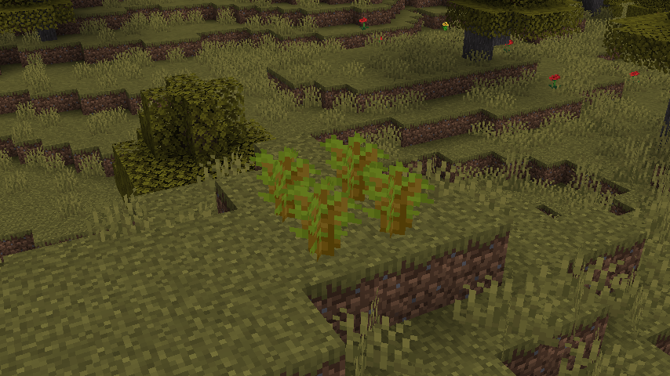

# Big Acacia

A simple plugin to add support for 2x2 acacia trees.

## ✨ Usage

In order to use this plugin, simply drag & drop the latest release's JAR file into your `./plugins/` folder. After that,
restart your server to apply the change.

In-game, simply build out a 2x2 sapling structure such as this:

Once that's done, bonemeal it as any other valid sapling setup to grow it.

⚠️ **HEADS UP**: Just like Vanilla trees, if there are invalid blocks (anything but Acacia logs, leaves or saplings),
the tree will not grow!

To help with this, the plugin will show particle effects at blocking blocks. Simply break them to allow the tree to
grow!

---

## ⚙️ Commands & Permissions

- `/acacia save <name>`: Save a new tree variant (`bigacacia.save`)
- `/acacia list`: (`bigacacia.list`)
- `/acacia delete`: (`bigacacia.delete`)
- `/acacia debug`: (`bigacacia.debug`)

Other permissions:

- `bigacacia.selectorigin`: Select the sapling origin with a wooden hoe
- `bigacacia.select1`: Select the first corner with a wooden hoe
- `bigacacia.select2`: Select the second corner with a wooden hoe

---

## 🌴 Adding Trees

By default, there are four variants of 2x2 acacia trees that have equal chances of spawning.

If you'd like to add additional ones, please follow the steps below:

1. Mark out two blocks that when connected as the complete opposite sides of a square's corners, contain all the blocks
   of your tree.
2. Left-click one of the blocks to select the 1st position
3. Right-click the other to select the 2nd position
4. Shift-click the **North-Western** sapling position of your tree to set the origin position.
5. Execute the `/acacia save <name>` command replacing `<name>` with your tree variant's name.

This will save your tree to the configuration file. You can list existing ones using `/acacia list`

When marking out the corners, always make sure to use the smallest amount of space and remove any blocks that are not
supposed to be part of the tree.

